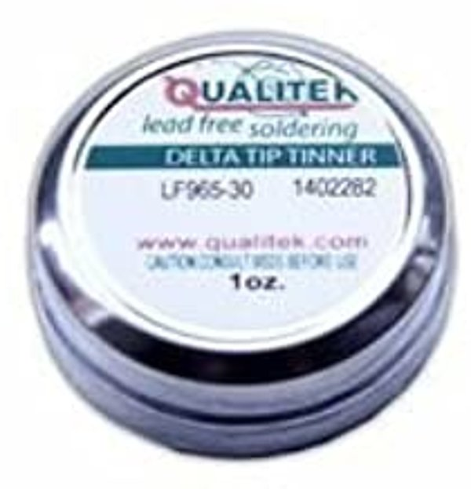

# Getting Started with rosco_m68k

## Building your kit

### Yay! Your kit has arrived! Here are a few handy tips for the build...

So you've just received your kit, and no doubt you're itching to build it. Perhaps you're a seasoned soldering pro or maybe this is all new to you – either way, read on for some handy tips and lessons we learned by soldering a lot of these things...

#### Things you'll need:
- A soldering iron (we recommend a temperature controlled one, but it doesn't have to be anything fancy!)
- Some solder (We like lead-free, 1mm diameter)
- Supplies for cleaning and caring for your iron (see below)
- (Optional) Masking tape

#### Take me to the BOM!
If you're an old pro at this, the links below will take you directly to the BOM for your board revision:
- [Revision 1 BOM](https://github.com/rosco-m68k/rosco_m68k/blob/master/design/r1/kicad/rosco_m68k.csv)
- [Revision 1.2 BOM](https://github.com/rosco-m68k/rosco_m68k/blob/release/revision-1.2/design/r1.2/kicad/rosco_m68k.csv)
- [Classic v2 BOM](https://github.com/rosco-m68k/rosco_m68k/blob/release/version-2.0/design/r2/kicad/rosco_m68k.csv)

---

## Recommended order of assembly

This is the way we generally approach building a rosco_m68k. Your mileage may vary!

When we build the rosco_m68k, we have a standard approach that we tend to follow. In fact, we find this tends to work for most PCB-based projects, though there are often cases where it makes sense to vary it. However, for this board, this is the order we pretty much always do it in:

1. First of all, we solder the resistors.
2. Next, we do the ceramic capacitors.
3. After those are done, it's time for the button.
4. Then, we do the crystals...
5. ... followed by the chip sockets (if using)
6. Now do any ICs that aren't going to be socketed.
7. After that we add the LEDs
8. Then it's time for the pin headers
9. Next, the small electrolytic capacitors are added
10. And finally the large electrolytic

You'll probably notice that, with this approach, we take the smallest components in terms of height first, and gradually add the taller components as we go. We find this works well with this board, and makes it easy to handle during the build. That said, of course this isn't a hard and fast rule – this is your kit, how you build it is totally up to you!

Let's take a look at each component type, and we'll talk about any tips we have for them individually.

### Resistors
There's not a lot to say here. We tend to place these in logical groups, soldering each group and trimming the leads before moving on to the next group, but you could just as easily place them all at once (either bending the leads or using masking tape to keep them in place) and then solder them in one go. We prefer doing them in groups because it means the leads are less likely to get in your way. As with all the components, aim to have it flush with the board (to minimise additional lead length) and if you can, try to have it nice and central between the holes.

### Ceramic capacitors
Sometimes our suppliers send us ceramics where the leads have a wider footprint than the body, so in that case you'll want to gently straighten out the leads (we recommend a pair of needle-nose pliers for this job). Again, we like to solder these in groups, and try to get them as flush with the board as possible – you might need to gently pull them from the back-side of the board before soldering to get them snugly into place.

### Button
The button is pretty simple, and the one we supply neatly holds itself in place while you solder it so you don't need to worry about it having short leads. Simply push the button into the holes (don't worry, it only fits the right way) and solder it in. Be sure to use the edge of your soldering tip here to ensure the leg is heated along with the pad and the solder should just slide into place.

### IC sockets
These should be pretty easy too. A bit of masking tape is your friend here, we tend to do a strip across the RAM, ROM and MFP, then do the CPU and glue logic with another strip or two, depending on width. If your iron is the right temperature it doesn't take long to get each leg and pad to flow temperature, and you'll probably find a nice rhythm by the time you've done a few so although there are a lot of legs, it doesn't take too long. We like to start by soldering the opposite corner pins, and checking the socket is straight before doing the rest. If it's moved, you can just re-do the corners.

### Crystals
Again, we usually put a bit of masking tape over each crystal to hold it in place. Bending the leads works too, but don't bend them too much, and we do find that the crystals tend to move around a bit when soldering if just using bent leads, hence the tape. The crystals we supply are pretty hardy, but try not to get them too hot during soldering – if a joint isn't happening on the first try, let it cool a bit and then have another go.

### LEDs
The main thing to watch with these is that you get the polarity right. The silkscreen has one flat side for each LED – this is the side where the short leg should go (if using LEDs we supply, the body of the LED has a matching flat spot, as do most standard 5mm LEDs). LEDs 1 and 4 should be green, and 2 and 3 should be red. We don't recommend using other colours – you might need to adjust the value of some of the resistors if you want to do that. We usually use a bit of masking tape to hold the LEDs in place, and take a moment to double check they're standing straight before you solder them – it's super annoying when you turn the board over to find that one of them has leaned over to the side somehow while you were soldering it...

### Pin headers
The pin headers take a little more heat than most of the other components, but not much. You'll probably find a nice rhythm, just as you did for the IC sockets. We use masking tape here too, and again double check – the headers are prone to leaning, just like the LEDs. A useful trick for the small headers (the two and four pin power and UART connectors) is to push the long-side pins through your masking tape, then stick it to the board with the short pins through the holes, ready to solder. We find this makes them easier to place properly and helps keep them straight.

### ICs
This is probably where there is the most potential for damage during soldering, but with a bit of care you should be fine. Take your time, and remember that heat build up inside the chip is cumulative, so if you rush through the legs doing one after the other, you're almost as likely to damage the part as if you held too long on an individual leg. It's unfortunate that replacing a heat-damaged IC is likely to be the most expensive damage you can do while building your board, and they're also the least fun parts to desolder if you have to, so it's worth having some patience and getting it right first time. Also, be wary of electrostatic discharge when handling the chips – try to handle them as little as possible, and avoid touching the legs if you can. If you have an antistatic mat or wrist strap, all the better. Oh, and make sure you get the chips the right way around – the semicircular indentation on one end of the chip should match the same indentation on the silkscreen. Check and double check – there's nothing more annoying than doing a perfect job soldering in a chip, only to have to remove it again because it's in backwards... Just like the sockets, we'd advise doing opposite corners first.

### Electrolytic capacitors
Make sure these are flush to the board before you solder them – you might have to use a little force to push them properly into place. Once you've done that, you'll probably find that they keep themselves in place while you solder, but they are a bit sneaky and will sometimes lean over after you turn the board over to solder them. If you need to, you can add a bit of tape to hold them in place. Like the crystals, these don't like a lot of heat – they aren't quite as touchy about it as the ICs, but still, take your time and if a joint isn't taking the solder, back off and let things cool down before taking another run at that joint. It's important that you get these the right way around! There's a little plus sign (+) on the board for each electrolytic – this is the side where the longer leg should go. The body of these capacitors will have a different coloured stripe on one side, which should go on the opposite side from the + (i.e. the stripe denotes the - side). When you're done, all the stripes should be facing the same way.

---

## Cleaning

You may want to clean your board after soldering everything up. Depending on the flux you used (or that came inside your solder) this might be necessary, but it's nice to remove any left-over globs of flux and other sticky bits that are left over from soldering.

You can buy various commercial products to do this, but Isopropyl Alcohol is our preferred chemical most of the time. Get the 99% stuff, and use it sparingly with Q-tips and a stiff (though not metal!) brush for best results. Let your board dry completely before connecting anything up.

Is it worth the hassle of cleaning your board? Well, if you don't, it'll most likely work just fine (in any event, there isn't anything that could be wrong that cleaning with IPA will fix) and will probably last for decades assuming you've not used anything crazy in terms of flux or other chemicals. If you do clean it, it'll look more professional and "finished" and you'll be able to rest easy knowing there's nothing nasty eating away at your copper. The choice is yours.

> **Danger!**
>
> Isopropyl Alcohol is highly flammable and toxic if swallowed! Always read the warnings on the bottle carefully and ensure you follow all directions. Use personal-protective equipment when using IPA. Only use in a well-ventilated area, keep away from all sources of ignition and try not to breathe in any fumes. Avoid contact with the skin and eyes.

---

## Additional soldering supplies

You don't need these, but they definitely help...

### Soldering Iron Metal Sponge

It's likely that your soldering iron came with a sponge, which is designed to be used wet (otherwise it'll tend to melt). This definitely has its uses, but there will be times where it's not enough. If your iron is starting to get really dirty with oxidation and whatnot, one of these metal sponges can come in very handy. Obviously using one of these does abraid your tip a bit more than a wet sponge, so you don't want to use it all the time, but the number of times where a quick run through this fixes things and gives you a nice clean tip to solder with will outweigh any downsides. [Get one here (Amazon UK)](https://www.amazon.co.uk/Silverline-281271-Soldering-Cleaning-Ball/dp/B011SFFRQC)

### Tip Tinner

Handy for getting rid of oxidation on your soldering tip and tinning it at the same time, this is usually acid-based and works instantly on a hot iron. Obviously being acid-based it will eventually eat away at the plating on your tip, but for an occasional refresh of a heavily oxidized tip it's hard to beat this stuff. Plus, it's lead-free and it lasts forever, though that might be because it's ridiculously difficult to actually open the tin. [Pick it up here (Amazon UK)](https://www.amazon.co.uk/Antex-XM000Y0B-Soldering-Tip-Tinner/dp/B01ECH04HA/ref=sr_1_5?dchild=1&keywords=tip+tinner&qid=1586461553&s=diy&sr=1-5)

### Desoldering Braid

Everyone makes mistakes, and occasionally you will too. Inevitably, some of those mistakes will occur while soldering. This stuff is the "undo" button of soldering. Not really just for mistakes, this comes in handy whenever you need to remove some solder, whether you've added bit too much, or you're removing a component from some other circuit in order to recycle it. It works a bit like a wick (in fact, it's also known as "solder wick") – you place it on the solder you want to remove, apply heat, and the solder gets soaked up into the braid. It's probably not as much fun as its more glamorous cousin, the desoldering pump (or "solder sucker"), but it's reliable, plentiful and cheap. Plus it's not impossible to clean, and doesn't involve globs of molten metal flying around so it's probably safer, at least than the cheaper end of the pump range. [Get it here (Amazon UK)](https://www.amazon.co.uk/Spirig-WICK2-2-1-5-3S-Wick-Desoldering-Antistatic/dp/B00KX20MG2/ref=sr_1_3?dchild=1&keywords=desoldering+braid&qid=1586463181&s=diy&sr=1-3)

---

## Soldering 101

If you're new to soldering, this is worth a watch...

There are lots of soldering tutorials on YouTube, but this one is nice and concise and says most of what we'd have said, probably better than we would have.

### Recommended Video

**How to Solder: Through-Hole Soldering**  
by SparkFun Electronics ([Watch on YouTube](https://www.youtube.com/watch?v=Qps9woUGkvI))

---

Copyright © 2020-2024 The Really Old-School Company Limited. Registered in England and Wales No. 12596175
The Really Old-School Company Ltd, 15 Starthe Bank, GB DE75 7AX Tel: 0330 133 2083
